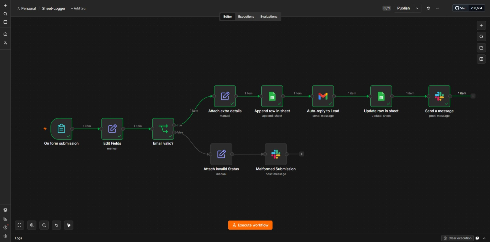
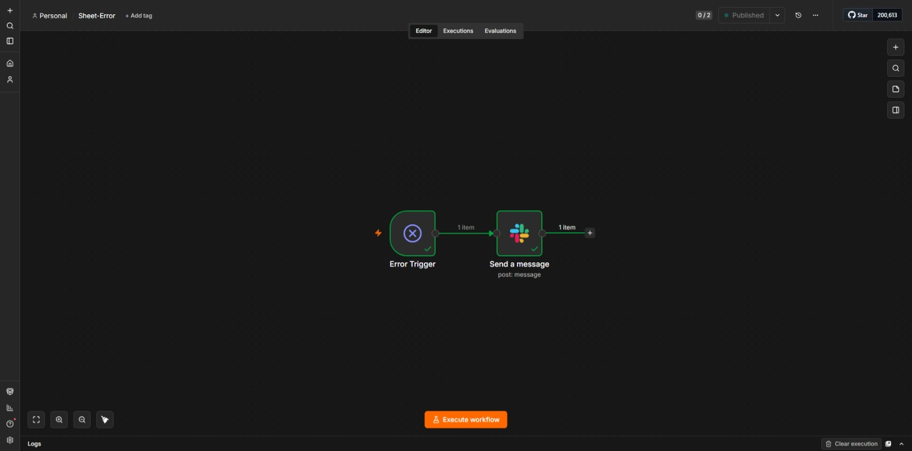
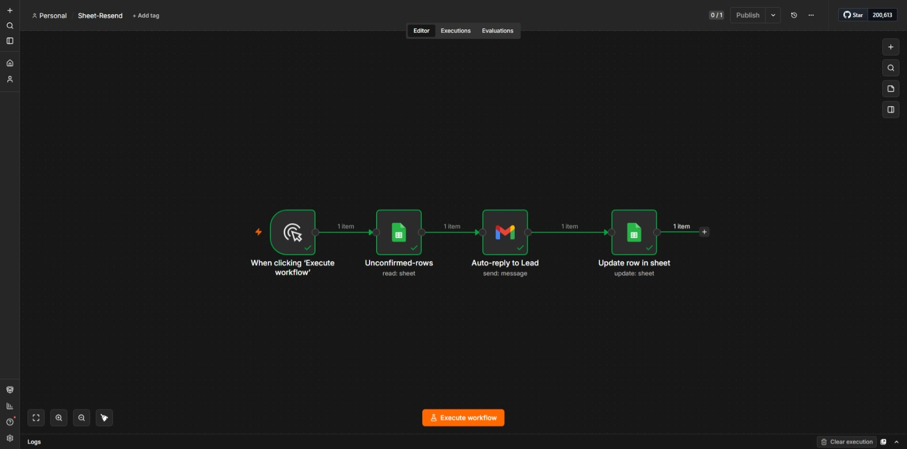
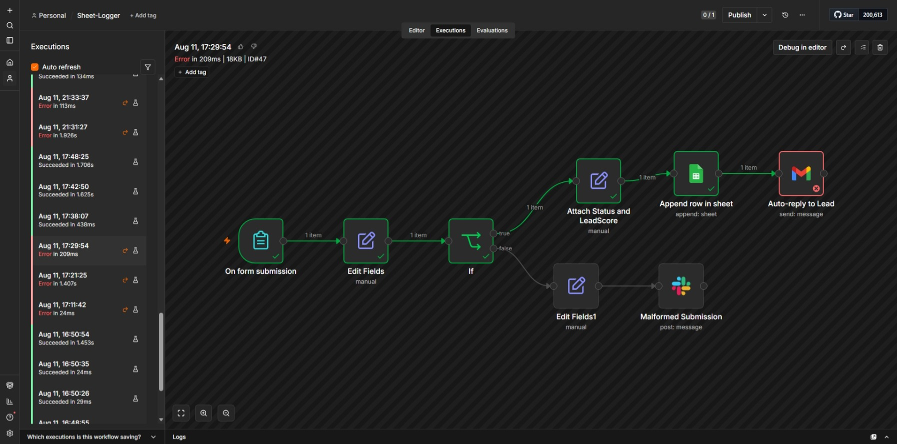
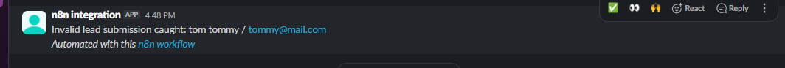
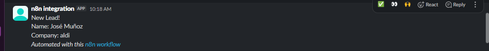

# Form-to-Sheet Lead Logger

**Stack:** n8n, Google Sheets, Gmail, Slack | **Status:** Production-tested

## The Problem

A small business collects leads through a web form but manually copies each submission into a spreadsheet to track and follow up. It's slow, error-prone, and leads get missed especially when whoever's supposed to be copying them over is busy with something else.

## The Solution

Three small n8n workflows instead of one big one:

1. **Sheet-Logger** (the main flow) — triggered by a form submission, validates the email, logs the lead to Google Sheets, sends the lead a confirmation email, and posts a Slack notification.
2. **Sheet-Error** — a separate workflow wired in through n8n's Error Workflow setting, so if anything in Sheet Logger fails, it automatically posts the failure to Slack.
3. **Sheet-Resend** — a manually-triggered recovery flow. If the confirmation email fails but the lead was already saved to the sheet, this finds row(s) still marked unconfirmed and resends to just them.

Splitting it into three was a deliberate choice. Each one has a single job (log, notify-on-failure, recover), which makes each easy to reason about and test on its own.

## Key Design Decisions

- **Sheets write happens before the Gmail send, not after.** If Gmail fails (e.g. bad address), the lead is already safely in the sheet only the confirmation email is missing. Losing an email is annoying; losing the lead entirely is the actual disaster, so the order of operations protects the thing that matters more.
- **A `Confirmation Sent` flag instead of trying to detect Gmail failures directly.** It starts as `false` when the row is created, and only flips to `true` in a step that runs _after_ Gmail succeeds. If Gmail fails, the workflow never reaches that step, so the flag just stays `false` — no separate failure-detection logic needed. The absence of the update _is_ the signal.
- **Invalid emails get caught with a regex check before anything gets written.** Malformed submissions are routed to a separate branch that flags the status and posts a Slack alert with the name and the bad email, instead of silently logging garbage data or trying to email an address that isn't real.
- **Recovery is manual, not automatic.** Sheet Resend has to be run on purpose, by a person, after they see a failure alert in Slack. I didn't want a system that auto-retries emails on a timer — if there's a real problem (e.g. Gmail is down), automatically hammering it isn't obviously better than a human deciding when to try again.

## Reliability & Edge Cases Handled

- **Malformed email format** - caught by regex before the Sheets write, routed to a separate "invalid" branch with its own Slack alert, no confirmation email attempted.
- **Gmail send fails after the Sheets write succeeds** - lead data isn't lost, `Confirmation Sent` stays `false`, Sheet Error posts to Slack, and Sheet Resend can pick it up later.
- **Same lead submits the form twice** - both rows get logged as-is for now. Sheet Resend matches on email, so if there are two rows with the same address, only one would get updated correctly. I know this is a real limitation, not something I'm pretending is handled. Documented here on purpose rather than fixed, since fixing it properly means matching on a unique ID instead of email, which i will change later.
- **Recovery flow processing multiple unconfirmed rows** - originally built this with a Loop Over Items node, then realized n8n already runs every node once per input item automatically — the Loop node wasn't adding anything for a handful of rows, so I removed it entirely. If this needs to resend to hundreds of leads at once, add throttling with a "Wait node" note rather than building something we don't need yet.

## Outcome / Impact

- Lead response time drops from "whenever someone remembers to check the inbox" to under 5 seconds, with zero manual copy-paste.
- Zero lead data lost in testing, including when the Gmail step was deliberately made to fail — the sheet write and the email send are decoupled on purpose.
- Every failure surfaces in Slack instead of failing silently; recovery from a failed confirmation email takes one manual workflow run instead of digging through logs data.

## Tech Stack

`n8n` `Google Sheets` `Gmail` `Slack` `Node types used: Form Trigger, Edit Fields, IF, Google Sheets (Append/Update/Get row(s)), Gmail, Slack, Error Trigger, Manual Trigger`

## Screenshots / Evidence

- 
- 
- 
- 
- 
- 
