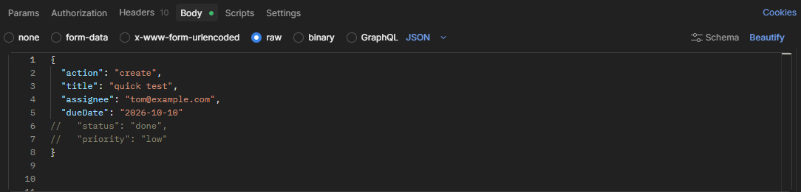
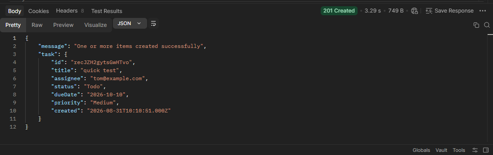

# Task-Manager-Sync-API — How It Works

## What this does

This workflow accepts Authenticated post requests from clients/users through a JSON format and creates a
database record on Airtable. A request must contain a valid action field such as create, read, update or delete. It routes each request based on the action provided, validates the required fields (title, assignee and dueDate) and provides default values for optional fields (status and priority).

### Authentication Note

This workflow uses `Header Auth` for authentication. You will need a valid x-api-key attached to the Headers (I generated one from here; `https://it-tools.tech/token-generator`). You can reach out to me if you intend testing my personal instance.

## What triggers it

Activated by an HTTP webhook; the workflow runs each time the webhook URL receives a request.

## What you'll see when it works

- A successful request is received with an HTTP 200 response code and 201 for new task created.
- A new record/row appears in the target table on Airtable
- A valid HTTP response for each request consist of JSON body and valid HTTP status code.
- Each successful request will return a response body containing a `message` and `task` fields. Read tasks returns an extra `totalTasks` field.

## How to tell if something's wrong

- A failed request will return a 400 response code for bad requests, 404 for unavailable records or 422 for unproccesable entities/fields.
- No new row appears on the table in Airtable
- Each failed request, in addition to the response code, will return a JSON body containing a `message` and `error` fields. The `error` field contains specific reasons for failure.

## Who to contact if it breaks

Contact the person who manages workflow. You can send me a mail also `oyebadesegunsam@gmail.com`

## Example requests

Send a POST request and include either of the following bodies in the JSON body for desired operation;

- create task
  `{
  "action": "create",
  "title": "quick test",
  "assignee": "john@example.com",
  "dueDate": "2026-10-10"
}`

- get task(s)
  `{
  "action": "read"
}`
  For get requests, providing only the action field returns all tasks from the table. You can filter by providing additional fields like assignee, status or priority. E.g.
  `{
    "action": "read"
    // "assignee": "sam@example.com",
    // "status": "in progress",
    // "priority": "medium"
}`

- update task
  `{
    "action": "update",
    "id": "recTheRecordId"
    // "assignee": "sam@example.com",
    // "status": "in progress",
    // "priority": "medium"
}`
  Id is required for update while the remaining fields are optional depending on desired update.

- delete task (soft delete)
  `{
    "action": "delete",
    "id": "recTheRecordId"
}`
  This marks the status field as `Archived`.

## API doc

Hit the workflow's info endpoint for a compact JSON description of the service, supported actions, and example fields.

## Example request and response screenshot

- 
- 
