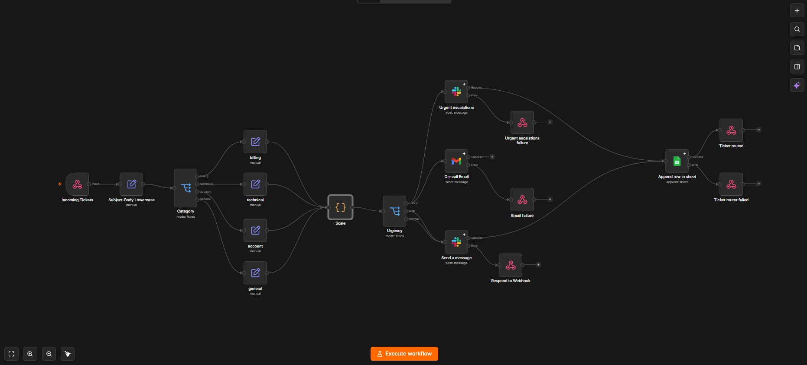

# Smart Support Ticket Router

**Stack** n8n, Slack, Gmail, Google-Sheets | **Status:** Production-tested

## The Problem

A small support team gets every ticket into one inbox and reads each one manually to figure out
how urgent it is and who should handle it. Urgent stuff (outages, billing failures) can end up
sitting behind routine questions with nobody noticing until a customer follows up angry.

## The Solution

Tickets arrive via webhook (simulating a helpdesk's outgoing "new ticket" event). The workflow
lowercases the subject/body, classifies the ticket into a category by keyword match (billing,
technical, account, general), then a Code node scores urgency (critical/high/normal) based on
keyword signals and the customer's plan tier. Urgency determines where it goes: critical hits
`#urgent-escalations` in Slack and emails on-call; high and normal route to
`#high-response-team` / `#normal-response-team`. Every ticket regardless of path, gets logged
to a Google Sheets audit trail with its id, category, urgency, routing decision, and timestamp.

## Key Design Decisions

- **Urgency-based Slack channels, not category-based.** The spec originally called for
  per-category channels (`#billing-team`, `#technical-team`, etc.), but I don't have separate
  specialized teams — so building 4+ channels to simulate an org structure that doesn't exist
  would've been solving a problem I don't have. Routed by urgency instead, since "get the right
  eyes on it fast" matters more at this scale than "get it to the right department." Category is
  still captured in the audit log, so nothing's lost. It's just not the routing key.
- **Urgency scoring lives in one Code node, not a chain of IF/Switch expressions.** I started
  building this as inline Switch rules and it got hard to read fast — moved the logic into a
  single Code node that outputs a plain `critical`/`high`/`normal` string, so the routing Switch
  downstream is just simple equality checks. Easier to debug, easier to test in isolation.
- **All four category branches converge into one shared urgency-check step**, instead of
  repeating the urgency logic four times. n8n lets multiple branches feed into the same
  downstream node. So one Code node, one Switch, no duplicated logic to keep in sync later.
- **Critical alerts truncate the ticket body to 200 characters in Slack.**
- **Every branch — critical, high, normal — funnels into one final Sheets-append node.**

## Reliability & Edge Cases Handled

- **Missing `plan_tier` in the payload** originally crashed the whole execution
  (`plan_tier.toLowerCase()` on `undefined`). Caught in testing, fixed with a fallback:
  `(plan_tier || "free").toLowerCase()`.
- **Overly broad technical-keyword matching** → my first version of the urgency Code node made
  any technical-category ticket automatically Critical i.e. a Free-tier user reporting a minor UI glitch got treated the same as a full outage. Caught this during testing, not by design. Narrowed the critical trigger to actual outage language (`down|outage|can't access|urgent|immediately`) and left milder bug reports to fall through to
  tier-based and technical high/normal scoring like everything else.
- **Category overlap** (a ticket matching both billing and account keywords, e.g. "billing error
  after password reset"). The category Switch resolves to whichever rule is listed first;
  documented rather than treated as an edge case I need to eliminate.
- **Slack/email send failures** each notification node has its own error branch, so a failed
  Slack post doesn't silently swallow the ticket, an error response is received.

## Outcome / Impact

- Urgent tickets get flagged and routed in seconds instead of waiting for someone to manually
  read through the inbox.
- 100% of test tickets — across all 4 categories and all 3 urgency levels — produced a routing
  decision and a matching audit log row.
- Fixed a real crash bug (missing `plan_tier`) and a real false-positive bug (over-broad
  technical-keyword matching) during testing rather than shipping them.

## Tech Stack

`n8n` `Slack` `Gmail` `Google Sheets`
`Node types used: Webhook, Edit Fields, Switch (category), Code (urgency scoring), Switch
(routing), Slack, Gmail, Google Sheets (Append)`

## Screenshots / Evidence

- 
