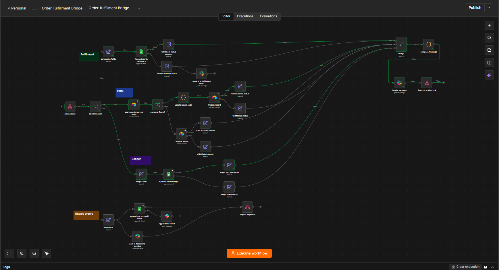

# E-commerce Order Fulfillment Bridge - case-study.md

**Stack:** n8n, Google Sheets, Airtable, Slack | **Status:** Production-tested

## The Problem

A small online store's order data needs to reach three separate systems — a fulfillment queue,
a customer CRM, and a revenue ledger — but staff were manually re-entering the same order into
all three. Slow, error-prone, and nothing guaranteed the three systems stayed in sync with
each other.

## The Solution

One webhook receives the order. Unpaid orders get logged to an Unpaid orders sheet and stop there, nothing
touches fulfillment, CRM, or ledger until payment is confirmed. Paid orders fan out into three
independent branches running in parallel: a fulfillment row appended to a Pick & Pack sheet, a
customer record upserted in Airtable (new customer created, returning customer's order history
and lifetime value updated), and a row appended to a Revenue Ledger. All three branches converge
on a Merge node, which only fires once every branch has reported in success or failure and
posts one honest summary to Slack reflecting exactly what happened on each branch.

## Key Design Decisions

- **Unpaid orders are a dead-end branch, on purpose.** They get logged and a Slack ping goes to
  accounts-payable, then the workflow stops. No fulfillment, no CRM update, no ledger entry for
  money that hasn't actually arrived.
- **CRM match is by email, normalized to lowercase before comparing.** `Priya.K@Example.com` and
  `priya.k@example.com` resolve to the same customer, tested explicitly to confirm this doesn't
  silently create a duplicate record.
- **Customer updates match by Airtable's internal record ID, not by email.** Email is only used
  to _find_ the record via Search; the actual Update operation targets the record's `id` field.
  Conflating the two was an early point of confusion worth getting right, since matching by the
  wrong key is a quiet, hard-to-notice class of bug.
- **Every branch reports its own status into the final confirmation, instead of one blind "done"
  message.** Each branch (fulfillment, CRM, ledger) runs with Continue On Fail, and both its
  success and error paths converge into the same Merge input carrying an explicit status string.
  The final Slack message reads something like `✅ Fulfillment, ❌ CRM, ✅ Ledger` rather than a
  single checkmark that could be lying about one of the three systems.
- **A failed write still reaches the confirmation message, it doesn't just alert separately and
  disappear.** Earlier drafts had failure Slack alerts that dead-ended, informative in the
  moment, but invisible from the order-level summary. Fixed by routing every outcome, success or
  error, through the same convergence point.

## Reliability & Edge Cases Handled

- **Unpaid/pending orders** isolated branch, confirmed nothing in fulfillment/CRM/
  ledger gets touched.
- **New vs. returning customer** Search-then-branch logic (found = Update, not found = Create),
  tested against a pre-seeded customer record to confirm the Update path appends to existing
  order history and increments lifetime value correctly, rather than overwriting it.
- **Email capitalization mismatch** normalized to lowercase before the Airtable search, tested
  explicitly to confirm it doesn't create a duplicate customer.
- **One branch failing shouldn't silently sink the whole order or produce a false "all good"
  message** Continue On Fail + per-branch status strings feeding a single, honest Merge output.
- **Dangling failure nodes that reported an error but never completed the execution** caught
  during review, not testing - several Slack-on-error nodes had nothing wired after them, which
  would've meant a failed branch left Merge waiting forever and the webhook caller never got a
  response. Fixed by making every path, success or error, converge.
- **Zero-dollar orders (fully discounted)** logs normally, not treated as an error or skipped.

## Outcome / Impact

- One order event now reliably updates three systems instead of three manual entries.
- Zero duplicate customer records across repeated-customer and capitalization-mismatch test
  cases.
- The confirmation message is actually trustworthy, a partial failure is visibly different from
  full success, not hidden behind a generic "processed" message.

## Tech Stack

`n8n` `Google Sheets` `Airtable` `Slack`
`Node types used: Webhook, IF, Set/Edit Fields, Google Sheets (Append), Airtable (Search/Update/
Create), Code, Merge, Slack, Respond to Webhook`

## Screenshots / Evidence

- 
